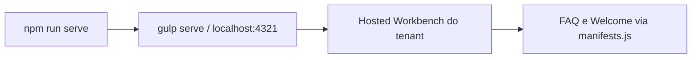
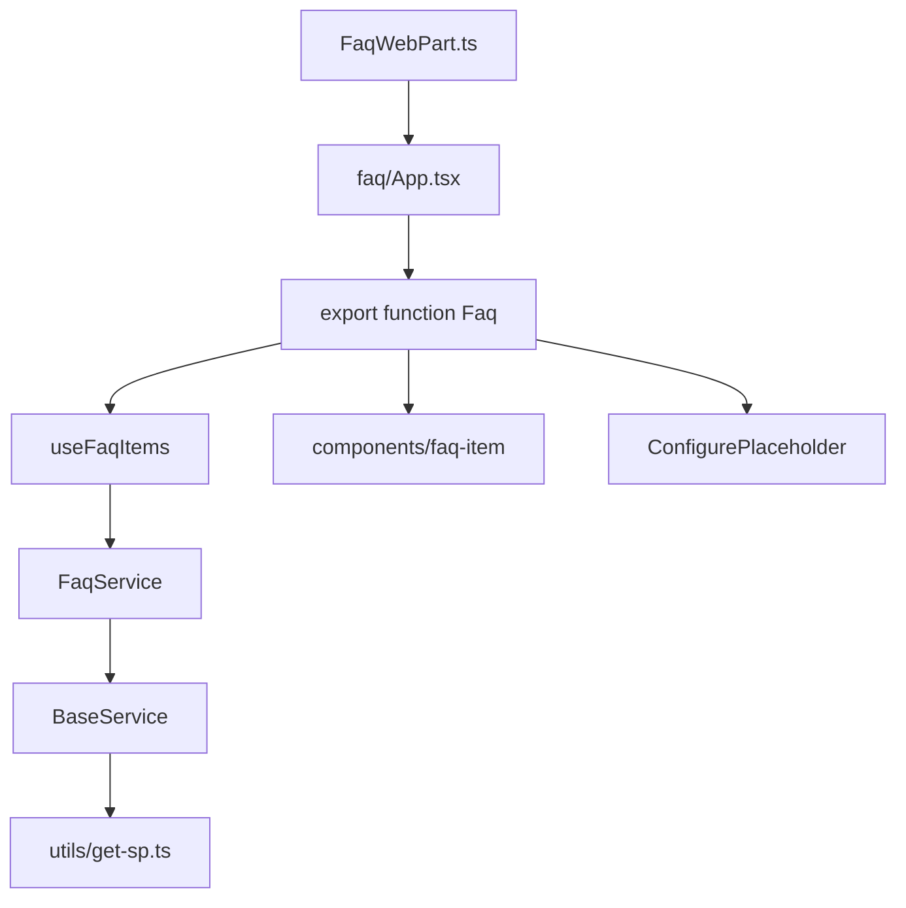

# SPFxWebParts

Solução [SharePoint Framework (SPFx)](https://learn.microsoft.com/pt-br/sharepoint/dev/spfx/sharepoint-framework-overview) **1.21.1** com duas web parts: **Welcome** (saudação por período do dia) e **FAQ** (accordion alimentado por uma lista SharePoint). O projeto segue uma arquitetura modular: WebPart fino → `App.tsx` → componentes React como função, com services PnPjs, hooks e styles separados.

Nome npm: `spfx-tools` · pacote: `solution/spfx-tools.sppkg`

## Stack e Versões

| Tecnologia | Versão | Documentação |
| --- | --- | --- |
| SharePoint Framework (SPFx) | 1.21.1 | [Docs SPFx](https://learn.microsoft.com/pt-br/sharepoint/dev/spfx/sharepoint-framework-overview) |
| Node.js | >= 22.14.0 < 23.0.0 (`.nvmrc`: 22.17.0) | [Docs Node.js](https://nodejs.org/docs/latest-v22.x/api/) |
| TypeScript | ~5.3.3 | [Docs TypeScript](https://www.typescriptlang.org/docs/) |
| React | 17.0.1 | [Docs React](https://legacy.reactjs.org/docs/getting-started.html) |
| Fluent UI React | ^8.106.4 | [Docs Fluent UI](https://developer.microsoft.com/en-us/fluentui#/controls/web) |
| PnPjs (`@pnp/sp`) | ^4.17.0 | [Docs PnPjs](https://pnp.github.io/pnpjs/) |
| PnP SPFx Controls | 3.23.0 | [PnP SPFx Controls](https://pnp.github.io/sp-dev-fx-controls-react/) |
| PnP Property Controls | 3.21.0 | [PnP Property Controls](https://pnp.github.io/sp-dev-fx-property-controls/) |
| Gulp | 4.0.2 | [Docs Gulp](https://gulpjs.com/docs/en/getting-started/quick-start) |
| ESLint | 8.57.1 | [Docs ESLint](https://eslint.org/docs/latest/) |

## Pré-requisitos

- [Node.js](https://nodejs.org/) **v22.17.0** (veja [`.nvmrc`](.nvmrc); compatível com `>=22.14.0 <23.0.0` em [`package.json`](package.json))
- npm
- Um [tenant Microsoft 365](https://learn.microsoft.com/pt-br/sharepoint/dev/spfx/set-up-your-developer-tenant) com SharePoint Online
- Certificado de desenvolvimento SPFx (configurado na primeira execução com `npx gulp trust-dev-cert`)

Se `npm install` falhar por conflito de peer dependencies, use `npm install --legacy-peer-deps`.

## Configuração do Ambiente

```bash
# 1. Clonar e entrar no repositório
cd SPFxWebParts

# 2. Usar a versão correta do Node
nvm use          # ou: nvm install (lê .nvmrc → 22.17.0)

# 3. Instalar dependências
npm install

# 4. Confiar no certificado de desenvolvimento SPFx (primeira vez)
npx gulp trust-dev-cert
```

Edite [`config/serve.json`](config/serve.json) e ajuste `initialPage` para o workbench do seu tenant. O valor atual de exemplo é:

```json
"initialPage": "https://yorclouddev.sharepoint.com/_layouts/workbench.aspx"
```

Substitua pelo site em que você testa, por exemplo:

```json
"initialPage": "https://{seu-tenant}.sharepoint.com/sites/{seu-site}/_layouts/15/workbench.aspx"
```

## Executar Localmente

O servidor de desenvolvimento roda em `https://localhost:4321` com HTTPS (porta definida em [`config/serve.json`](config/serve.json)).

| Comando | Quando usar |
| --- | --- |
| `npm run serve` | Serve padrão SPFx (`gulp serve --nobrowser`, com `NODE_OPTIONS=--max_old_space_size=8192`) |
| `gulp serve` | Mesmo serve SPFx (task remapeada em [`gulpfile.js`](gulpfile.js)) |
| `npm run dev` | Script `fast-serve` — só use se o [spfx-fast-serve](https://github.com/s-KaiNet/spfx-fast-serve) estiver instalado; **não está** nas dependências deste `package.json` |

### Passos para testar no tenant

1. Execute `npm run serve`.
2. Aceite o certificado local no navegador, se solicitado.
3. Abra o **hosted workbench** do tenant com o parâmetro de debug:

   ```
   https://{seu-tenant}.sharepoint.com/sites/{seu-site}/_layouts/15/workbench.aspx?debugManifestsFile=https://localhost:4321/temp/manifests.js
   ```

4. Adicione a web part **Welcome** ou **FAQ** na página de teste.



## Web Parts da Solução

Cadeia de renderização (as duas web parts):

```
*WebPart.ts  →  App.tsx  →  components/index.tsx (export function)
```

Hosts suportados: SharePoint Web Part, Teams Personal App, Teams Tab e SharePoint Full Page. Theme variants habilitado.

### Welcome (`welcome`)

Saudação com o nome do usuário logado (`pageContext.user.displayName`) e uma mensagem conforme o horário.

| Horário | Propriedade |
| --- | --- |
| 00:00–11:59 | `morningMessage` |
| 12:00–17:59 | `afternoonMessage` |
| 18:00–23:59 | `eveningMessage` |

- **Property pane:** mensagem da manhã, da tarde e da noite
- **Empty state:** se a mensagem do período estiver vazia, exibe Placeholder com botão **Configure** (abre o pane)
- **Sem lista SharePoint:** só usa contexto do usuário e as três strings do pane

### FAQ (`faq`)

Accordion de perguntas e respostas lido de uma lista SharePoint escolhida no property pane. Usa PnPjs (`FaqService`) e o hook `useFaqItems`.

- **Property pane:** seletor de lista (`listId`) via `PropertyFieldListPicker`
- **Apply:** `disableReactivePropertyChanges` está `true` — é preciso clicar em **Apply** para recarregar
- **Dados:** até 50 itens, campos `Id`, `Title` e `Body`
- **Empty state:** sem lista configurada, Placeholder com **Configure**; lista vazia mostra “No items found.”



## Pré-requisitos SharePoint (FAQ)

A web part Welcome não depende de listas. A **FAQ** precisa de uma lista no site com as colunas abaixo (o usuário escolhe a lista no pane; não há nome interno fixo no código).

| Coluna | Tipo sugerido | Uso |
| --- | --- | --- |
| `Title` | Texto (coluna padrão) | Título do accordion |
| `Body` | Texto de várias linhas | Conteúdo da resposta |

Permissão mínima: leitura na lista selecionada.

## Dependências do Projeto

Organizadas conforme [`package.json`](package.json).

### dependencies

| Pacote | Versão | Papel no projeto |
| --- | --- | --- |
| `@microsoft/sp-component-base` | 1.21.1 | Base de componentes SPFx (tema) |
| `@microsoft/sp-core-library` | 1.21.1 | Biblioteca central do SPFx |
| `@microsoft/sp-lodash-subset` | 1.21.1 | `escape` no Welcome |
| `@microsoft/sp-office-ui-fabric-core` | 1.21.1 | Estilos Office UI Fabric Core |
| `@microsoft/sp-property-pane` | 1.21.1 | Painel de propriedades |
| `@microsoft/sp-webpart-base` | 1.21.1 | Classe base das web parts |
| `@fluentui/react` | ^8.106.4 | Componentes de interface |
| `@pnp/sp` | ^4.17.0 | Listas e itens SharePoint |
| `@pnp/core` / `@pnp/queryable` | ^4.17.0 | Núcleo PnPjs |
| `@pnp/spfx-controls-react` | 3.23.0 | `Placeholder` e `Accordion` |
| `@pnp/spfx-property-controls` | 3.21.0 | `PropertyFieldListPicker` na FAQ |
| `react` / `react-dom` | 17.0.1 | UI |
| `tslib` | 2.3.1 | Helpers de runtime TypeScript |

### devDependencies

| Pacote | Versão | Papel no projeto |
| --- | --- | --- |
| `@microsoft/sp-build-web` | 1.21.1 | Rig de build Gulp do SPFx |
| `@microsoft/sp-module-interfaces` | 1.21.1 | Interfaces de módulo SPFx |
| `@microsoft/eslint-config-spfx` | 1.21.1 | Regras ESLint para SPFx |
| `@microsoft/eslint-plugin-spfx` | 1.21.1 | Plugin ESLint SPFx |
| `@microsoft/rush-stack-compiler-5.3` | 0.1.0 | Compilador TypeScript do SPFx |
| `@rushstack/eslint-config` | 4.0.1 | Configuração ESLint Rush Stack |
| `@types/react` | 17.0.45 | Tipos TypeScript para React |
| `@types/react-dom` | 17.0.17 | Tipos TypeScript para React DOM |
| `@types/webpack-env` | ~1.15.2 | Tipos para ambiente Webpack |
| `typescript` | ~5.3.3 | Compilador TypeScript |
| `gulp` | 4.0.2 | Executor de tarefas de build |
| `eslint` | 8.57.1 | Linter |
| `eslint-plugin-react-hooks` | 4.3.0 | Regras para React Hooks |
| `ajv` | ^6.12.5 | Validador JSON Schema (build) |

## Scripts Disponíveis

| Script | Comando | Descrição |
| --- | --- | --- |
| `npm run serve` | `gulp serve --nobrowser` | Servidor local SPFx (recomendado para desenvolvimento) |
| `npm run build` | `gulp bundle` | Bundle de debug |
| `npm run package` | `gulp bundle --ship --production` + `gulp package-solution` | Empacota a solução (`.sppkg`) |
| `npm run clean` | `gulp clean` | Remove artefatos de build (`lib/`, `dist/`, `temp/`, etc.) |
| `npm run test` | `gulp test` | Testes via rig SPFx |
| `npm run dev` | `fast-serve` | Hot reload — requer fast-serve instalado à parte |

Tarefas gulp adicionais (via `npx gulp`): `trust-dev-cert`, `clean`, `bundle`, `package-solution`.

## Testes

| Comando | Descrição |
| --- | --- |
| `npm run test` | Executa `gulp test` (rig SPFx padrão) |

O repositório **não possui** arquivos `.spec.ts` / `.test.ts` no momento. A verificação principal no desenvolvimento é o `gulp bundle` / teste no hosted workbench.

## Build e Deploy

```bash
# Bundle de debug
npm run build

# Empacotar solução (.sppkg)
npm run package
# Gera: solution/spfx-tools.sppkg
```

**Pós-deploy:**

1. Faça upload do `.sppkg` no **App Catalog** do tenant.
2. Faça deploy da solução nos sites alvo (`skipFeatureDeployment: true` em [`config/package-solution.json`](config/package-solution.json) — o app precisa ser adicionado em cada site).
3. Para a FAQ, crie/aponta uma lista com `Title` e `Body` e selecione-a no property pane.
4. Para o Welcome, preencha as três mensagens no pane.
5. **Opcional (CDN):** [`config/write-manifests.json`](config/write-manifests.json) e [`config/deploy-azure-storage.json`](config/deploy-azure-storage.json) ainda têm placeholders (`cdnBasePath`, account/accessKey, container `spfx-tools`).

## Estrutura do Projeto

```
src/
  webparts/
    faq/
      FaqWebPart.ts              # Classe SPFx (pane + mount do App)
      App.tsx                    # export function App
      components/
        index.tsx                # export function Faq
        styles.module.scss
        props.d.ts
        faq-item/                # Accordion de um item
      hooks/use-faq-items.ts
      loc/
    welcome/
      WelcomeWebPart.ts
      App.tsx
      components/
        index.tsx                # export function Welcome
        styles.module.scss
        props.d.ts
      hooks/use-greeting.ts
      loc/
  components/                    # UI compartilhada (ConfigurePlaceholder)
  services/
    base/base.service.ts         # PnP via getSP
    faq.service.ts
  hooks/                         # Barrel de hooks compartilhados (reservado)
  utils/get-sp.ts                # Bootstrap único do PnPjs
  styles/_variables.scss         # Tokens SCSS
config/                          # serve.json, package-solution.json, config.json
gulpfile.js
```

Não aninhar `components/components/` — filhos ficam em pastas irmãs sob um único `components/`.

## Diretrizes de Desenvolvimento

### Estilo de Código

- **ESLint:** configuração padrão SPFx (`@microsoft/eslint-config-spfx` + Rush Stack), executada no `gulp bundle`
- **Componentes:** `export function Nome` (named export). A classe `*WebPart` continua `export default` (exigência SPFx)
- **Pastas de UI:** kebab-case + `index.tsx` + `styles.module.scss` co-localizado

### Configuração TypeScript

- **Target:** ES5 · **Module:** ESNext · **JSX:** `react`
- **Decorators experimentais:** habilitado
- **Verificação de tipos:** `noImplicitAny` habilitado

### Padrões de Arquitetura

- **WebPart:** só lifecycle SPFx, property pane e `React.createElement(App, { context, ...properties })`
- **App:** composição; hoje sem providers (não há i18n/profile neste solution)
- **Services:** estendem `BaseService`; FAQ não instancia PnP no componente
- **Hooks:** de domínio ficam na web part (`use-faq-items`, `use-greeting`); `src/hooks/` só para reuso real
- **PnP:** um único `getSP(context)` em [`src/utils/get-sp.ts`](src/utils/get-sp.ts)
- **Styles:** tokens em `_variables.scss`; módulos importam com `@use ".../styles/variables" as *`
- **Strings de UI:** `loc/en-us.js` + `mystrings.d.ts` (não hardcoded no JSX)

## Troubleshooting

| Sintoma | Causa provável | Ação |
| --- | --- | --- |
| Erro de versão do Node | Versão fora de 22.x | `nvm use` (22.17.0) — o build SPFx 1.21.1 não roda em Node 10/16 |
| `npm run dev` falha (`fast-serve` not found) | Helper não está no `package.json` | Use `npm run serve` |
| Certificado não confiável no navegador | Certificado dev SPFx não instalado | `npx gulp trust-dev-cert` |
| Web part não aparece no workbench | Servidor inativo ou URL sem debug | Confirme `npm run serve` e o parâmetro `debugManifestsFile` |
| FAQ: “No items found.” / erro PnP | Lista sem `Title`/`Body` ou sem permissão | Confira colunas e permissão de leitura |
| FAQ não atualiza ao trocar a lista | Pane não-reativo | Clique em **Apply** |
| Welcome só mostra Placeholder | Mensagem do período vazia | Preencha morning/afternoon/evening no pane |
| Erro de memória no serve | Bundle | O script `serve` já usa `NODE_OPTIONS=--max_old_space_size=8192` |
| `gulp bundle` falha em sass `@use` | Path relativo do `_variables.scss` | Confira `@use` a partir da pasta do `.module.scss` até `src/styles/` |

## Referências

- [Visão geral do SPFx](https://learn.microsoft.com/pt-br/sharepoint/dev/spfx/sharepoint-framework-overview)
- [Configurar ambiente de desenvolvimento SPFx](https://learn.microsoft.com/pt-br/sharepoint/dev/spfx/set-up-your-development-environment)
- [Conectar ao SharePoint com PnPjs](https://pnp.github.io/pnpjs/getting-started/)
- [Componentes Fluent UI React](https://developer.microsoft.com/en-us/fluentui#/controls/web)
- [PnP SPFx Controls](https://pnp.github.io/sp-dev-fx-controls-react/)
- [PnP Property Controls](https://pnp.github.io/sp-dev-fx-property-controls/)
- [Microsoft 365 Patterns and Practices](https://aka.ms/m365pnp)
